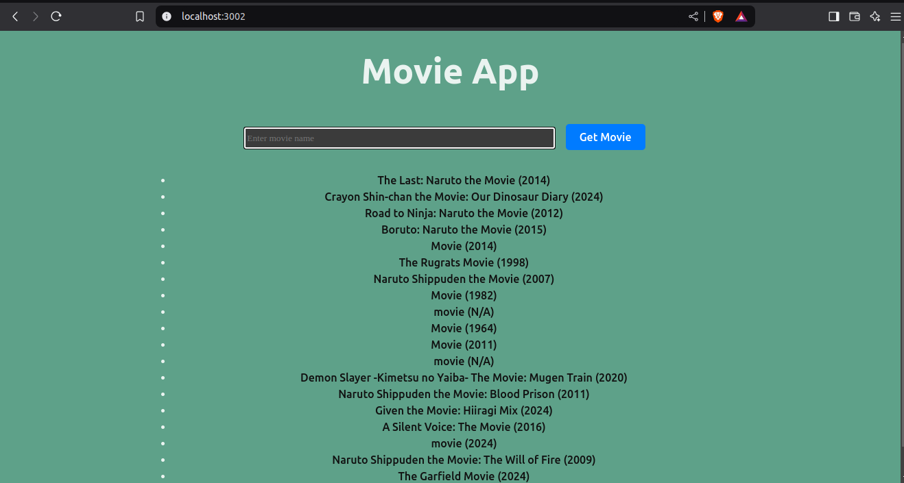
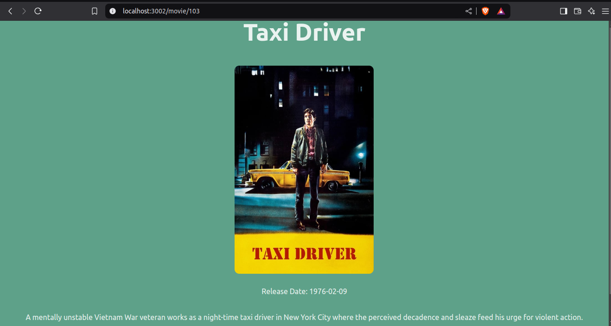

# The Movie App

An application that uses The Movie Database API to search, list and display movie details

# Basic Features

1. Search for a movie.
2. List of movies with that name is displayed.
3. Display movie details - Title, Release Date, Overview and Poster(image).

